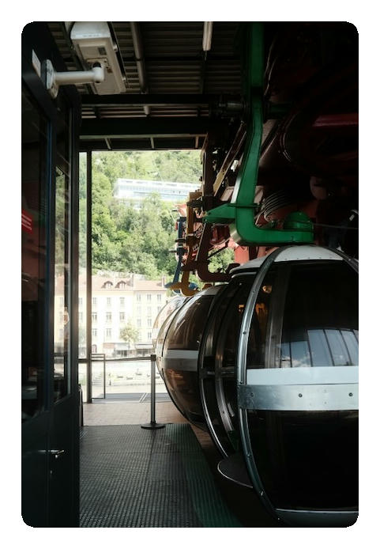
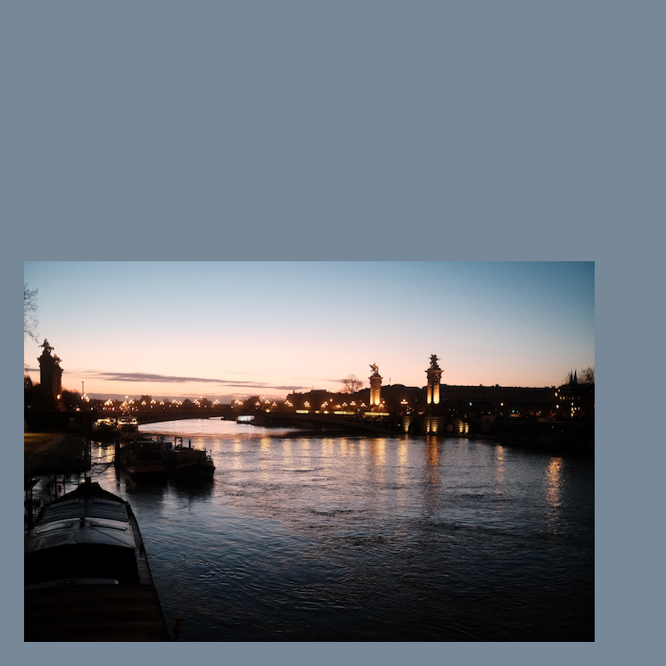

# oliframe

[](https://github.com/calteran/oliframe/actions/workflows/ci.yml)
[](https://crates.io/crates/oliframe)
[](https://docs.rs/oliframe)
[](https://calteran.mit-license.org/)

**Oliframe** is a command-line tool written in [Rust](https://www.rust-lang.org) to add simple colored frames (borders)
around images.
It is designed to efficiently batch process images with a consistent border style.
Flexible options allow for customization of the border width, color, and corner radius.

This project was inspired by the style of posts by [`@officialmumbo`](https://www.instagram.com/officialmumbo/) on
Instagram, but is not endorsed by or affiliated with him.

## Installation

```bash
$ cargo install oliframe
```

## Usage

```bash
$ oliframe --help
```

```text
Usage: oliframe [OPTIONS]

Options:
  -v, --verbose  Verbose output
  -q, --quiet    Quiet output -- suppresses everything except errors
  -h, --help     Print help
  -V, --version  Print version

Input Options:
  -i, --input <FILE_OR_DIR>  One or more input file_collector or directories, if not specified, the current directory is used
  -R, --recursive            Recursively search for input file_collector in the specified director(y/ies)
  -x, --extension <XTN>      File extensions(s) to accept (must be exact match, i.e.: "jpg" != "jpeg" != "JPG")

Output Options:
      --dry-run               Dry run (don't create output file_collector)
  -o, --output <FILE/FOLDER>  Output destination. If skipped, each output file will be saved in the same directory as the input file
  -f, --flatten               Flatten the output directory structure when processing multiple input file_collector
  -p, --prefix <PREFIX>       Prefix to prepend to output file_collector
  -s, --suffix <SUFFIX>       Suffix to append to output file_collector
  -y, --overwrite             Overwrite existing files.  Defaults to no

Framing Options:
      --ar <RATIO>           Fix the final aspect ratio of the output image. Specify the ratio as a fraction (e.g.: "16:9") or a decimal (e.g.: "1.777")
  -c, --color <COLOR>        Color of the border/background.  Specify any valid CSS color [default: white]
  -r, --radius <RADIUS>      Add rounded corners to the image.
  -m, --margins <SIZE(S)>    Relative margins around the image, as a percentage of (width + height) / 2. Specify one to four values, separated by commas, in CSS order
  -P, --position <POSITION>  Relative position of the input image within the output image. Horizontal values: "left", "center", "right" Vertical values: "top", "center", "bottom"

```

## Examples

The default behavior is to add a white border that's 5% of the image size to all images in the current directory.
Oliframe will not overwrite existing files by default, so you must use the -y flag to allow overwriting.

```bash
$ oliframe -y
````


---

Rounded corners can be added by specifying a radius.
Instead of editing in place, you can optionally specify an output directory with the -o flag.

```bash
$ oliframe --radius 20 -o framed_images
```



---

More complex borders can be created by specifying the color, final aspect ratio, and position of the image within the
frame.

```bash
$ oliframe --color darkslategray --ar 1:1 --position bottom-left -m 10,50,10,10
```



## Roadmap / Future Functionality

- [ ] Add option (-W, --watch) to watch for changes in a directory and automatically add borders to new images

## Contributing

Pull requests are welcome. For major changes, please open an issue first to discuss what you would like to change.

## License

[MIT](https://choosealicense.com/licenses/mit/)

## AI-Assisted Development

This project has been developed with the assistance of AI-powered tools, including ChatGPT and GitHub Copilot.
These tools have contributed to various aspects of the code,
ranging from generating initial code snippets to offering suggestions for code optimization and bug fixes.
While these tools have aided in the development process,
the design and implementation of this project is the work of the author.
